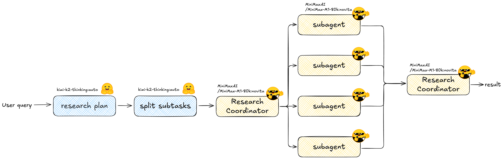

# Multi-Agent Deep Research with Smolagents + Firecrawl

Think of this as the written version of the video: a friendly walkthrough of how to wire up a deep‑research pipeline that runs on open models, uses Firecrawl to search and scrape, and leans on smolagents for clean orchestration. Grab a coffee—let’s build it together.



## What We’re Building 
1) You type a question in the CLI.
2) A planner LLM drafts a thorough research map.
3) A splitter LLM turns that map into bite‑sized, non‑overlapping subtasks (JSON).
4) A coordinator agent spins up one sub-agent per subtask; every sub-agent can search & scrape the web through Firecrawl’s MCP toolkit.
5) The coordinator stitches every mini-report into one polished markdown file: `research_result.md`.

Everything below points to code in this repo so you can connect the dots as you read.

## Quick Setup (so you can follow along)
- Python 3.11
- Env vars: `HF_TOKEN` (Hugging Face Inference) and `FIRECRAWL_API_KEY` (for MCP tools).
- Install deps: `uv sync` (or `pip install -e .`).
- Run the pipeline: `uv run main.py`, then enter any research question.

## Step 1: Draft a Research Plan (`planner.py`)
We start by asking an open model to write the plan for us. It streams tokens, so you watch it think. But that is not necessary. You can just remove the `stream=True` flag and return the full completion if you want.

Also, feel free to check the `prompts.py` file to see the system instructions for the planner.

```python
# planner.py
from huggingface_hub import InferenceClient
from prompts import PLANNER_SYSTEM_INSTRUCTIONS

def generate_research_plan(user_query: str) -> str:
    MODEL_ID = "moonshotai/Kimi-K2-Thinking"
    PROVIDER = "auto"

    planner_client = InferenceClient(
        api_key=os.environ["HF_TOKEN"],
        #bill_to="huggingface",
        provider=PROVIDER,
    )

    completion = planner_client.chat.completions.create(
        model=MODEL_ID,
        messages=[
            {"role": "system", "content": PLANNER_SYSTEM_INSTRUCTIONS},
            {"role": "user", "content": user_query},
        ],
        stream=True,
    )
    # stream chunks into a string and return
```

Why start with a planner? It keeps the later agents on the same page and forces the model to expose its assumptions (regions, time spans, variables, outputs) up front.

## Step 2: Split the Plan into Focused Subtasks (`task_splitter.py`)
Now we ask another model to turn that plan into structured JSON. Pydantic provides the schema, and Hugging Face’s `response_format` makes the LLM obey it.

In this example, I omit the `Field` descriptions for conciseness. It is a good practice to include them in production code to make the JSON schema self-documenting. The agent also sees the descriptions when it is reasoning about the subtasks.

```python
# task_splitter.py (core bits)
class Subtask(BaseModel):
    id: str
    title: str
    description: str

class SubtaskList(BaseModel):
    subtasks: List[Subtask]

TASK_SPLITTER_JSON_SCHEMA = {
    "name": "subtaskList",
    "schema": SubtaskList.model_json_schema(),
    "strict": True,
}

completion = client.chat.completions.create(
    model=MODEL_ID,
    messages=[
        {"role": "system", "content": TASK_SPLITTER_SYSTEM_INSTRUCTIONS},
        {"role": "user", "content": research_plan},
    ],
    response_format={
        "type": "json_schema",
        "json_schema": TASK_SPLITTER_JSON_SCHEMA,
    }
)

subtasks = json.loads(completion.choices[0].message.content)["subtasks"]
```

The payoff: each sub-agent gets a crisp mission like “Temperature data collection” or “Historical climate drivers,” so they don’t step on each other.

## Step 3: Coordinator + Sub-Agents Share Firecrawl Tools (`coordinator.py`)
Here’s where it gets fun. We reuse Firecrawl’s MCP server so we don’t have to hand-code search or scraping tools—the agents inherit them automatically.

You can also create your own research tools if you want to have full control over the search and scraping logic. But the team at Firecrawl already build a great set of tools that you can use out of the box. Check out the [Firecrawl MCP documentation](https://docs.firecrawl.dev/mcp-server) for more details.

```python
FIRECRAWL_API_KEY = os.environ["FIRECRAWL_API_KEY"]
MCP_URL = f"https://mcp.firecrawl.dev/{FIRECRAWL_API_KEY}/v2/mcp"

with MCPClient({"url": MCP_URL, "transport": "streamable-http"}) as mcp_tools:

    @tool
    def initialize_subagent(subtask_id: str, subtask_title: str, subtask_description: str) -> str:
        subagent = ToolCallingAgent(
            tools=mcp_tools,            # Firecrawl search/scrape
            model=subagent_model,
            add_base_tools=False,
            name=f"subagent_{subtask_id}",
        )

        subagent_prompt = SUBAGENT_PROMPT_TEMPLATE.format(
            user_query=user_query,
            research_plan=research_plan,
            subtask_id=subtask_id,
            subtask_title=subtask_title,
            subtask_description=subtask_description,
        )
        return subagent.run(subagent_prompt)
```

- Sub-agents all use the same prompt template from `prompts.py`, so their reports share structure (summary, analysis, bullets, sources).
- Models: coordinator and sub-agents default to `MiniMaxAI/MiniMax-M1-80k` via Novita. Swap `COORDINATOR_MODEL_ID` / `SUBAGENT_MODEL_ID` to try other long-context models.

### Coordinator Orchestration
The coordinator’s only “tool” is the ability to spawn sub-agents. It loops through the JSON subtasks, calls the tool once per subtask, waits, then merges the incoming markdown. Tekan look at the `COORDINATOR_PROMPT_TEMPLATE` in `prompts.py` to see how it works.

```python
coordinator = ToolCallingAgent(
    tools=[initialize_subagent],
    model=coordinator_model,
    add_base_tools=False,
    name="coordinator_agent",
)

coordinator_prompt = COORDINATOR_PROMPT_TEMPLATE.format(
    user_query=user_query,
    research_plan=research_plan,
    subtasks_json=json.dumps(subtasks, indent=2, ensure_ascii=False),
)

final_report = coordinator.run(coordinator_prompt)
```

The prompt literally says: “Call `initialize_subagent` for every subtask, then synthesize everything into one polished report.” No hidden magic—just tools + prompt discipline.

## Centralized Prompt Templates (`prompts.py`)
All the instructions live in one file so you can tweak the voice or structure in a single place and instantly affect every agent.

- `PLANNER_SYSTEM_INSTRUCTIONS`: tells the planner to output a detailed, first-person plan with explicit dimensions and expected format.
- `TASK_SPLITTER_SYSTEM_INSTRUCTIONS`: teaches the splitter to return 3–8 non-overlapping subtasks and to respect the JSON schema.
- `SUBAGENT_PROMPT_TEMPLATE`: shared by every sub-agent; we `.format` in the global query, full plan, and each task’s id/title/description so the only thing that changes is the task payload.
- `COORDINATOR_PROMPT_TEMPLATE`: guides orchestration—loop over subtasks, call the tool exactly once each, then produce a single markdown report with bibliography and open questions.

Why centralize? Because when you decide “let’s add stricter citation rules” or “make the summaries shorter,” you touch one file and the whole system listens. It’s also great for A/B testing—drop in an alternate template and toggle it with an env var or flag.

## Step 4: The Tiny CLI (`main.py`)
`main.py` is intentionally bare-bones: load env vars, ask for a question, run the pipeline, write `research_result.md`, and tell you where it went. That’s it.

```python
def main():
    load_dotenv()
    user_query = input("Enter your research query: ")
    result = run_deep_research(user_query)
    with open("research_result.md", "w") as f:
        f.write(result)
    print("Research result saved to research_result.md")
```

### Run the whole thing
Hit Enter, and logs start flying: first the planner, then the splitter, then a flurry of Firecrawl searches/scrapes as sub-agents work in parallel. Depending on your models and the scope, expect a few minutes.

## Run It Yourself (end-to-end)
1) Export keys: `export HF_TOKEN=...` and `export FIRECRAWL_API_KEY=...`.
2) Install: `uv sync`.
3) Start: `uv run main.py` and enter something ambitious (e.g., “How will offshore wind build-out affect New Jersey coastal grids by 2030?”).
4) Watch the console as agents spawn and call Firecrawl.
5) Open `research_result.md` to read the stitched report.

## Customize Without Breaking the Flow
- **Models:** Swap `MODEL_ID` constants in `planner.py`, `task_splitter.py`, and `coordinator.py`. Favor big context windows for coordinator/sub-agents.
- **Prompts:** Edit `prompts.py` to change tone, add citation rules, or enforce tables/charts.
- **Tools:** Firecrawl MCP already exposes search/scrape/map. Add your own `@tool` functions next to `initialize_subagent` if you need domain APIs.
- **Guardrails:** Add a “human approves plan” step, or cap the number of subtasks before spawning agents.

You now have a minimal—but inspectable—deep-research system that matches the video tutorial. Tinker with prompts, swap models, or bolt on new tools; the architecture is small enough that every change is easy to reason about.
